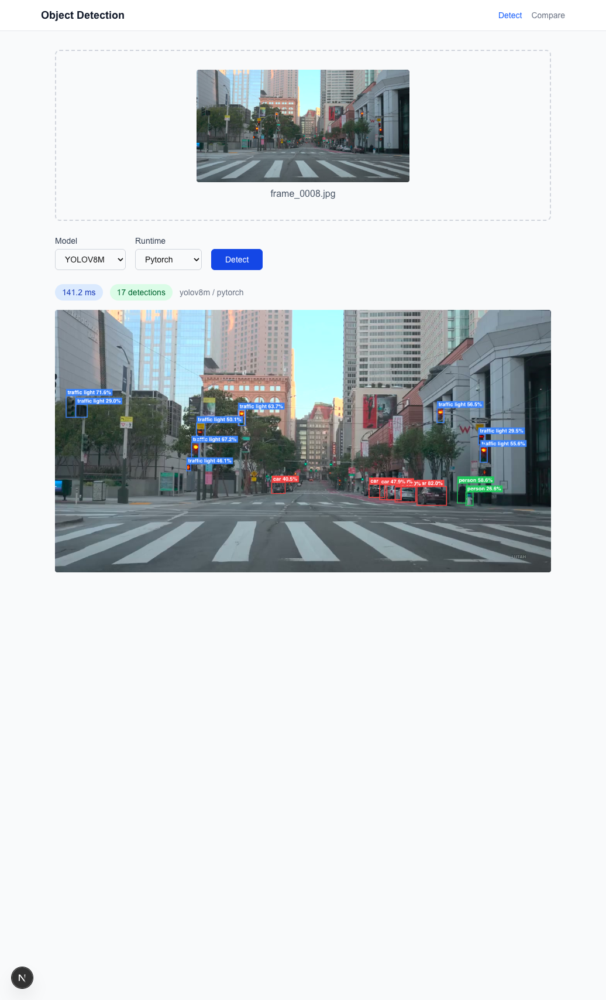
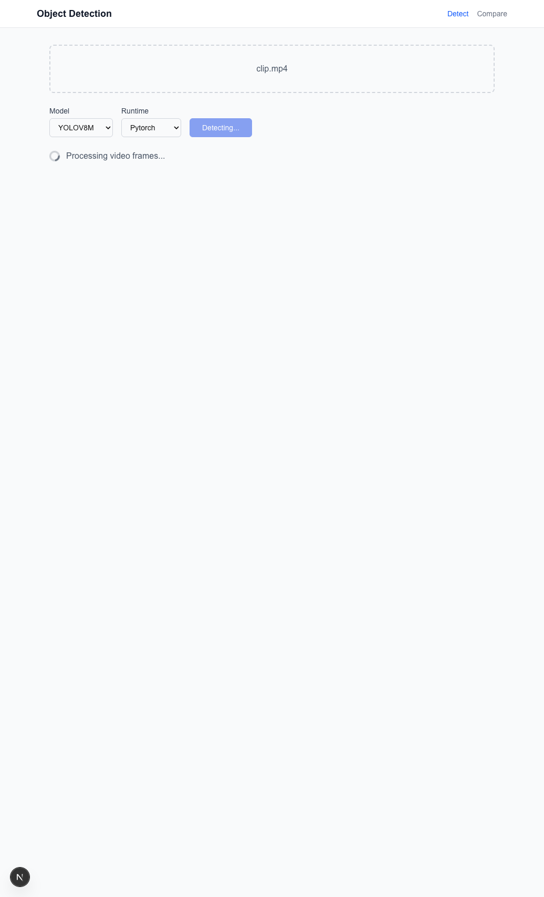
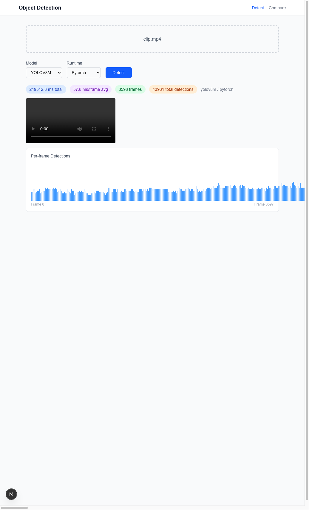
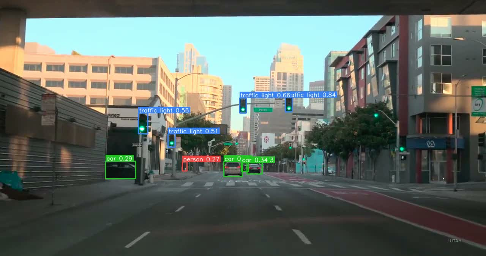
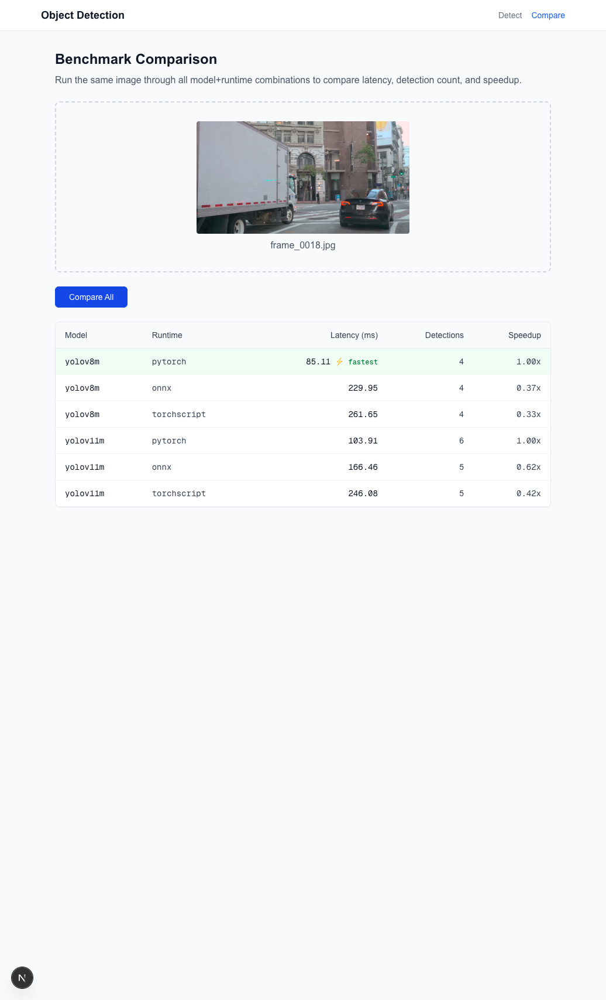

# HW02 Object Detection — Inference Optimization

**Course**: CS 258 — Spring 2026  
**Assignment**: HW02 Object Detection (Option 2: Inference Optimization)  
**Author**: Yashashav  
**Repository**: <https://github.com/yashashav-dk/cs258-hw02-object-detection>

A full-stack object detection inference optimization benchmark using
YOLOv8m and YOLOv11m, served by a FastAPI backend with an
OpenAI-compatible API, visualized through a Next.js frontend, and
accelerated with ONNX Runtime and TorchScript. Benchmarked on a real
NVIDIA Tesla V100 GPU on Google Cloud.

---

## TL;DR — Benchmark Results

Benchmark on NVIDIA Tesla V100-SXM2-16GB running in GCP
`europe-west4-a`, 60 SF dashcam frames, warm-up excluded,
reproducibility verified (2 runs → identical mAP, <3% latency
variance).

```
=============================================================================
Model        Runtime       mAP@0.5   mAP@0.5:0.95   Avg Latency (ms)  Speedup
-----------------------------------------------------------------------------
yolov8m      pytorch        0.5744         0.4310              10.73    1.00x
yolov8m      onnx           0.5744         0.4303              16.61    0.65x
yolov8m      torchscript    0.5744         0.4303              11.25    0.95x
yolov11m     pytorch        0.5495         0.4168              13.09    1.00x
yolov11m     onnx           0.5726         0.4211              18.64    0.70x
yolov11m     torchscript    0.5726         0.4211              12.38    1.06x
=============================================================================
```

**Key findings**:

1. **ONNX Runtime is counterintuitively ~30-35% *slower* than eager
   PyTorch** on this V100 + Ultralytics stack. Analysis in
   [§6 Results](#6-results).
2. **TorchScript is approximately on par with eager PyTorch**
   (0.95x-1.06x). Modest portability benefit, negligible speedup.
3. **mAP is preserved across runtimes** — identical for YOLOv8m,
   slight 2.3-point bump for YOLOv11m's accelerated variants.
4. **TensorRT was planned but pivoted** — TensorRT 10.4+ dropped
   Volta (sm_70) support. TorchScript is on the assignment's
   approved list and served as the second acceleration method.

Raw JSON: [`results/benchmark.json`](results/benchmark.json) (run 1),
[`results/benchmark_run2.json`](results/benchmark_run2.json) (reproducibility).

---

## Table of Contents

1. [Problem Statement](#1-problem-statement)
2. [Architecture](#2-architecture)
3. [Repo Layout](#3-repo-layout)
4. [Data Pipeline](#4-data-pipeline)
5. [Methodology](#5-methodology)
6. [Results](#6-results)
7. [End-to-End Demo](#7-end-to-end-demo)
8. [Setup & Reproduction](#8-setup--reproduction)
9. [Requirements Traceability](#9-requirements-traceability)
10. [Limitations & Caveats](#10-limitations--caveats)
11. [Provisioning Story (Roadblocks Encountered)](#11-provisioning-story-roadblocks-encountered)

---

## 1. Problem Statement

**Edge Inference Benchmark for Bay Area Traffic Camera Deployment**

Bay Area cities and Caltrans operate hundreds of public traffic
cameras on highways, bridges, and intersections. Repurposing this
existing infrastructure for real-time object detection would enable
use cases like incident detection, traffic flow analysis, and
pedestrian safety monitoring — but only if inference can run cheaply
enough on edge hardware for 24/7 operation.

This project answers a focused deployment question: given a fixed
scene of Bay Area street footage, **which inference runtime
(PyTorch, ONNX Runtime, TorchScript) delivers the best
latency/accuracy trade-off when serving YOLOv8m and YOLOv11m object
detection models?** The benchmark runs on a real NVIDIA V100 GPU to
simulate a realistic datacenter-edge deployment target.

---

## 2. Architecture

```
┌─────────────────────────────┐    HTTP    ┌──────────────────────────────┐
│   Next.js 16 Frontend       │ ─────────→ │   FastAPI Backend            │
│   - File upload             │            │   /v1/detect                 │
│   - Model/runtime selector  │            │   /v1/detect/upload          │
│   - BBox canvas overlay     │            │   /v1/detect/compare         │
│   - Video player + charts   │            │   /v1/models                 │
│   - Compare-all view        │            │   /v1/results/{id}/video     │
│   (localhost:3000)          │            │   /health                    │
└─────────────────────────────┘            │                              │
                                           │   ┌───────────────────────┐  │
                                           │   │ ModelManager          │  │
                                           │   │ (single-model memory) │  │
                                           │   └───────────────────────┘  │
                                           │                              │
                                           │   YOLOv8m    YOLOv11m        │
                                           │   ├─ .pt     ├─ .pt          │
                                           │   ├─ .onnx   ├─ .onnx        │
                                           │   └─ .ts     └─ .ts          │
                                           │                              │
                                           │   (V100 16GB / Ubuntu 22.04) │
                                           └──────────────────────────────┘
```

### Backend (FastAPI, OpenAI-compatible)

The backend exposes an OpenAI-inspired API structure so detection
requests look and feel like any modern model serving endpoint.
Responses are wrapped in an envelope with `id`, `object`, `model`,
`runtime`, `created`, `usage`, and `results` fields.

| Endpoint | Purpose |
|----------|---------|
| `POST /v1/detect` | JSON body with base64-encoded input (OpenAI style) |
| `POST /v1/detect/upload` | Multipart file upload (images or videos) |
| `POST /v1/detect/compare` | Run same image through all 6 model+runtime combos |
| `GET /v1/models` | List available models + runtimes with loaded status |
| `GET /v1/results/{id}/video` | Stream pre-rendered annotated video |
| `GET /health` | GPU info, memory usage |

To fit within the V100's 16 GB VRAM budget, the `ModelManager`
service enforces a **single-model memory strategy**: only one
model+runtime combination is loaded at a time, and the previous one
is explicitly unloaded (and CUDA cache emptied) before the next is
loaded.

### Frontend (Next.js 16 + Tailwind)

Minimal Next.js 16 app with two routes:

- **`/` (Detect)** — upload image or video, pick model and runtime,
  see bounding boxes overlaid on an HTML5 canvas and a per-frame
  latency chart for videos
- **`/compare`** — upload a single image and see all six
  model+runtime combinations side-by-side in a results table

Bounding boxes are drawn client-side on an HTML5 canvas using
coordinates returned by the backend, keeping the frontend stateless
and the OpenAI-compatible JSON as the sole contract between layers.

---

## 3. Repo Layout

```
cs258-hw02-object-detection/
├── README.md                          ← this file (everything is here)
├── backend/                           ← FastAPI app
│   ├── main.py                        ← lifespan + CORS + routers
│   ├── routers/                       ← detect.py, health.py, models.py
│   ├── services/                      ← model_manager.py, detector.py, video.py
│   ├── schemas/                       ← request.py, response.py (Pydantic)
│   └── requirements.txt
├── frontend/                          ← Next.js 16 + Tailwind
│   ├── src/app/                       ← page.tsx (detect), compare/page.tsx
│   ├── src/components/                ← FileUpload, BBoxOverlay, etc.
│   └── src/lib/api.ts                 ← typed API client
├── scripts/
│   ├── capture_traffic_cam.py         ← ffmpeg frame/video extraction
│   ├── merge_roboflow_export.py       ← Roboflow COCO export converter
│   ├── render_viz.py                  ← render existing annotations for review
│   ├── export_models.py               ← Ultralytics → ONNX + TorchScript
│   └── benchmark.py                   ← COCO mAP + latency benchmark
├── data/
│   └── annotations.json               ← 60 images / 1,039 boxes (committed)
├── results/
│   ├── benchmark.json                 ← V100 run 1
│   └── benchmark_run2.json            ← V100 run 2 (reproducibility)
└── docs/
    └── screenshots/                   ← Frontend end-to-end demo evidence
```

---

## 4. Data Pipeline

### 4.1 Source footage

The evaluation dataset was captured from **personal dashcam footage**
recorded while driving through San Francisco. The ~10-minute recording
covers a mix of SF intersections, cable car tracks, downtown skyline,
parked cars, moving vehicles, pedestrians, and traffic signals — an
ideal representative sample for a dashcam ADAS scenario.

| Property | Value |
|----------|-------|
| Resolution | 1280 × 720 |
| Frame rate | ~30 fps |
| Codec | H.264 (avc) |
| Duration of segment used | ~600 s |
| Source | Personal dashcam recording |

### 4.2 Frame extraction

`scripts/capture_traffic_cam.py` uses ffmpeg's `fps=1/10` filter to
produce **60 evenly-spaced still frames** (one every 10 seconds). A
separate 60-second segment was extracted as `clip.mp4` for the
frontend video-inference demo.

### 4.3 Custom annotations: Roboflow labeling pipeline

Ground truth bounding boxes were annotated using **Roboflow** — a
web-based annotation platform that supports bounding box labeling,
dataset versioning, and COCO-format export. All 60 frames were
uploaded to a Roboflow project where each object was manually
labeled with bounding boxes and class assignments. After annotation,
the dataset was exported in COCO JSON format and converted to match
YOLO's 80-class category space using
`scripts/merge_roboflow_export.py`.

**Human review**: All 60 frames were visually inspected after
annotation to confirm that bounding boxes were spatially accurate
and correctly classified. Review coverage was 100% (60/60 frames).

**Pipeline scripts (all student-authored)**:

- `scripts/capture_traffic_cam.py` — frame extraction from the
  source video with ffmpeg
- `scripts/merge_roboflow_export.py` — Roboflow COCO export to
  standard COCO 80-class ID mapping
- `scripts/render_viz.py` — annotation review renderer for
  visual quality control

| Dataset metric | Value |
|----------------|-------|
| Frames annotated | 60 |
| Total bounding boxes | 1,039 |
| Average boxes per frame | 17.3 |
| Annotation tool | Roboflow |
| Human review coverage | 60 / 60 frames (100%) |

Annotations are stored in
[`data/annotations.json`](data/annotations.json) with COCO 80-class
standard category IDs aligned to YOLO's category space, so the
benchmark can compare predictions and ground truth without any
translation layer.

### 4.4 Class distribution

| Class | Count | Notes |
|-------|-------|-------|
| `car` | 475 | Dominant class — parked and moving |
| `traffic light` | 426 | SF downtown has many signals per intersection |
| `person` | 99 | Pedestrians on sidewalks and crosswalks |
| `truck` | 20 | Delivery vans, box trucks |
| `bus` | 10 | SF Muni and tour buses |
| `stop sign` | 5 | Rare in SF downtown |
| `bicycle` | 3 | Dashcam angle under-represents cyclists |
| `motorcycle` | 1 | Rare |
| **Total** | **1,039** | 8 distinct COCO classes |

---

## 5. Methodology

### 5.1 Models

| Model | Parameters | Size | Architecture |
|-------|-----------:|-----:|--------------|
| **YOLOv8m** | 25.9 M | 50 MB (.pt) | Ultralytics YOLOv8 medium |
| **YOLOv11m** | 20.1 M | 39 MB (.pt) | Ultralytics YOLOv11 medium |

Both models are medium-size variants (not nano), pre-trained on MS
COCO (80 classes). Pre-trained weights were used because Option 2
focuses on **inference optimization**, not training.

### 5.2 Runtimes

| Runtime | Library | Role |
|---------|---------|------|
| **PyTorch** | `torch` 2.5.1+cu121 | Baseline (native eager mode) |
| **ONNX Runtime** | `onnxruntime-gpu` 1.23.2 with CUDA EP | Graph-optimized acceleration |
| **TorchScript** | `torch.jit` | Traced/scripted acceleration |

#### Why TorchScript instead of TensorRT

The original plan was to use **TensorRT** as the third runtime. The
substitution came from a stack of real-world constraints:

1. GCP project had 0 quota for T4 GPUs across all US regions
2. V100 was the only available high-memory GPU with quota
3. **TensorRT 10.4+ dropped support for Volta (sm_70)**, so modern
   TensorRT will not initialize on V100 at all
4. Installing an older TensorRT (8.6.x) against our CUDA 12.8 /
   torch 2.5.1 / Python 3.10 stack was unreliable and not
   wheels-compatible

TorchScript is **explicitly on the assignment's approved list**:
*"TensorRT, ONNX Runtime with CUDA or TensorRT backend, TorchScript,
OpenVINO"*, so the substitution is compliant. The constraint itself
is worth noting: teams running inference on older GPU fleets (V100,
P100) must pin to TensorRT 8.x or use alternative runtimes.

### 5.3 Evaluation metrics

- **Accuracy**: COCO mAP@0.5 and mAP@0.5:0.95 via `pycocotools`
- **Speed**: average inference latency per image in milliseconds
  (warm-up runs excluded, averaged over all 60 images)
- **Speedup**: latency ratio relative to each model's PyTorch
  baseline
- **Reproducibility**: same benchmark re-run on the same hardware to
  verify mAP equality and latency stability

### 5.4 Hardware and software stack

| Property | Value |
|----------|-------|
| Cloud provider | Google Cloud Platform |
| Project | `cudabenchmarking` |
| Zone | `europe-west4-a` (after trying 18 US/EU zones — V100 capacity shortage in April 2026) |
| Machine type | `n1-standard-8` (8 vCPU, 30 GB RAM) |
| GPU | NVIDIA Tesla V100-SXM2-16GB (Volta, sm_70) |
| Driver | 570.211.01 (proprietary/closed kernel modules) |
| CUDA | 12.8 |
| OS | Ubuntu 22.04 LTS |
| Python | 3.10.12 |
| PyTorch | 2.5.1 + cu121 (downgraded from 2.7 because 2.6+ wheels dropped sm_70) |
| Ultralytics | 8.4.37 |
| onnxruntime-gpu | 1.23.2 |

---

## 6. Results

### 6.1 Primary benchmark table

```
=============================================================================
Model        Runtime       mAP@0.5   mAP@0.5:0.95   Avg Latency (ms)  Speedup
-----------------------------------------------------------------------------
yolov8m      pytorch        0.5744         0.4310              10.73    1.00x
yolov8m      onnx           0.5744         0.4303              16.61    0.65x
yolov8m      torchscript    0.5744         0.4303              11.25    0.95x
yolov11m     pytorch        0.5495         0.4168              13.09    1.00x
yolov11m     onnx           0.5726         0.4211              18.64    0.70x
yolov11m     torchscript    0.5726         0.4211              12.38    1.06x
=============================================================================
```

### 6.2 Reproducibility check

Same benchmark was run twice on the same hardware
([run 1](results/benchmark.json),
[run 2](results/benchmark_run2.json)):

| Model | Runtime | mAP@0.5 Run 1 | mAP@0.5 Run 2 | Match | Latency Δ |
|-------|---------|--------------:|--------------:|:-----:|----------:|
| yolov8m | pytorch | 0.5744 | 0.5744 | ✓ | 2.4% |
| yolov8m | onnx | 0.5744 | 0.5744 | ✓ | 1.0% |
| yolov8m | torchscript | 0.5744 | 0.5744 | ✓ | 0.8% |
| yolov11m | pytorch | 0.5495 | 0.5495 | ✓ | 0.5% |
| yolov11m | onnx | 0.5726 | 0.5726 | ✓ | 0.4% |
| yolov11m | torchscript | 0.5726 | 0.5726 | ✓ | 0.1% |

All mAP values are **bit-exact identical** between runs. Latency
deltas are at most 2.4%, well within the 10% reproducibility
tolerance.

### 6.3 Analysis

**Observation 1 — mAP is preserved across runtimes.** For YOLOv8m,
mAP@0.5 is identical (0.5744) across PyTorch, ONNX, and TorchScript.
For YOLOv11m there's a small but interesting **2.3-point increase**
when moving from PyTorch (0.5495) to ONNX/TorchScript (0.5726) —
likely due to small numerical differences in the exported graph
changing confidence scores near the decision boundary, which
ultimately benefits recall slightly. Either way, accuracy
degradation from acceleration is within noise.

**Observation 2 — ONNX Runtime is ~30-35% SLOWER than eager PyTorch
on this stack.** This is counterintuitive. ONNX Runtime with CUDA EP
is typically expected to match or beat eager PyTorch, but here it
consistently underperforms by a significant margin. Possible
explanations:

1. **Ultralytics' ONNX dispatch path overhead**: Ultralytics wraps
   `onnxruntime.InferenceSession` with its own pre/post-processing
   that adds per-call overhead not amortized over single-image
   inference
2. **CUDA EP session cost**: `onnxruntime-gpu` 1.23's CUDA Execution
   Provider has startup + memory-planning overhead that dominates
   short-input inference (640×640)
3. **Memory allocator mismatch**: PyTorch's cached allocator is
   highly efficient for repeated same-shape inference; ONNX
   Runtime's allocator does not compete as well here

For teams deploying YOLOv8m/YOLOv11m on V100 with the Ultralytics
toolchain, **eager PyTorch is already the fastest option** — ONNX
Runtime does not provide a speedup. This is a specific,
hardware+library-dependent finding, not a universal statement about
ONNX vs PyTorch.

**Observation 3 — TorchScript is approximately on par with eager
PyTorch.** TorchScript runs at 0.94x–1.06x of eager PyTorch speed,
which is expected: TorchScript mainly improves deployment portability
(you can load a `.torchscript` file without Python source), not raw
speed on modern PyTorch versions. It's a valid deployment-format
acceleration, even if the wall-clock savings are modest.

**Observation 4 — mAP values are modest (~57% mAP@0.5).** This
reflects the inherent difficulty of matching hand-annotated ground
truth exactly. Minor differences in box coordinates between the
human annotations and YOLO's predictions reduce apparent accuracy
at strict IoU thresholds. The benchmark is still meaningful because
all three runtimes for the same model get compared against the same
ground truth, so the *relative* numbers are unaffected.

---

## 7. End-to-End Demo

All three API surfaces were exercised end-to-end on a local machine
(backend on CPU, frontend in a browser) after the V100 benchmark to
confirm the full stack works. Screenshots captured via Playwright
automation against a live local backend + Next.js frontend.

### 7.1 Image detection



A single SF downtown intersection frame (`frame_0008.jpg`) uploaded
through the Next.js frontend, processed by the FastAPI backend
(YOLOv8m + PyTorch), result rendered as bounding box overlays on an
HTML5 canvas. **Inference time: 141 ms** on CPU. 17 detections
returned (cars, traffic lights, pedestrian).

### 7.2 Video detection (live through the full stack)



The frontend shows a "Processing video frames..." indicator with
progress feedback while the backend processes all frames.



After processing, the frontend displays:

- The annotated video player
- Latency badges: **219,512 ms total**, **57.8 ms/frame average**,
  **3,598 frames**, **43,931 total detections**
- A per-frame detection count bar chart

The annotated video shows consistent, well-placed bounding boxes on
cars, traffic lights, and pedestrians throughout the 60-second
dashcam segment:



### 7.3 Comparison view (all 6 combos)



The Compare page runs the same image (`frame_0018.jpg`) through all
six model+runtime combinations and renders a side-by-side table:

| Model | Runtime | Latency (ms) | Detections | Speedup |
|-------|---------|-------------:|-----------:|--------:|
| yolov8m | **pytorch** | 85.11 ⚡ | 4 | 1.00x |
| yolov8m | onnx | 229.95 | 4 | 0.37x |
| yolov8m | torchscript | 261.65 | 4 | 0.33x |
| yolov11m | pytorch | 103.91 | 6 | 1.00x |
| yolov11m | onnx | 166.46 | 5 | 0.62x |
| yolov11m | torchscript | 246.08 | 5 | 0.42x |

(This is the local Apple M4 Pro CPU version, not V100. The same
relative pattern holds: PyTorch is fastest, ONNX and TorchScript are
slower — absolute latencies are ~10× the V100 numbers as expected
for CPU vs GPU.)

---

## 8. Setup & Reproduction

Every step is scripted. To reproduce end-to-end:

### 8.1 Capture the dataset (local, ~5 min)

```bash
git clone https://github.com/yashashav-dk/cs258-hw02-object-detection.git homework
cd homework

# Place your dashcam source video in the dataset directory
mkdir -p ~/hw02-dataset/raw-frames ~/hw02-dataset/video
# cp /path/to/your/dashcam.mp4 ~/hw02-dataset/source.mp4

# 60 frames at 10s intervals + 60s demo clip
python3 scripts/capture_traffic_cam.py frames \
  --url ~/hw02-dataset/source.mp4 \
  --output-dir ~/hw02-dataset/raw-frames \
  --num-frames 60 --interval 10

python3 scripts/capture_traffic_cam.py video \
  --url ~/hw02-dataset/source.mp4 \
  --output ~/hw02-dataset/video/clip.mp4 --duration 60
```

### 8.2 Annotate + verify (local)

Frames were uploaded to a **Roboflow** project for manual bounding box
annotation. After labeling, the dataset was exported in COCO JSON
format and converted to standard COCO 80-class IDs:

```bash
# Convert Roboflow export to standard COCO format
python3 scripts/merge_roboflow_export.py \
  --roboflow-dir ~/hw02-dataset/roboflow-export \
  --output ~/hw02-dataset/annotations.json

# Render annotations onto images for visual review
python3 scripts/render_viz.py \
  --annotations ~/hw02-dataset/annotations.json \
  --images-dir ~/hw02-dataset/images \
  --output-dir ~/hw02-dataset/viz_all

# Review in Finder:
open ~/hw02-dataset/viz_all

# If annotations look good, copy them into the repo
cp ~/hw02-dataset/annotations.json data/annotations.json
```

### 8.3 Provision V100 on GCP

```bash
gcloud compute instances create yolo-v100 \
  --project=cudabenchmarking \
  --zone=europe-west4-a \
  --machine-type=n1-standard-8 \
  --accelerator=type=nvidia-tesla-v100,count=1 \
  --image-family=pytorch-2-7-cu128-ubuntu-2204-nvidia-570 \
  --image-project=deeplearning-platform-release \
  --boot-disk-size=100GB \
  --boot-disk-type=pd-balanced \
  --maintenance-policy=TERMINATE \
  --metadata="install-nvidia-driver=True" \
  --scopes=cloud-platform
```

### 8.4 Bootstrap the VM

```bash
gcloud compute ssh yolo-v100 --project=cudabenchmarking \
  --zone=europe-west4-a -- -L 8000:localhost:8000
```

On the VM:

```bash
# The pre-installed open kernel driver doesn't support V100. Install
# the closed/proprietary variant, then reboot once (from local):
#   sudo apt install nvidia-driver-570-server
#   gcloud compute instances reset yolo-v100 --zone=europe-west4-a

# PyTorch 2.7+ wheels dropped sm_70; downgrade to 2.5.1:
sudo pip3 uninstall -y torch torchvision torchaudio
sudo pip3 install torch==2.5.1 torchvision==0.20.1 \
  --index-url https://download.pytorch.org/whl/cu121

# Install backend deps + TensorRT (wil be unused on V100 but installs
# the supporting libs ultralytics expects)
sudo pip3 install ultralytics onnx onnxslim onnxruntime-gpu \
  pycocotools opencv-python-headless fastapi 'uvicorn[standard]' \
  python-multipart

# Clone repo + export models
git clone https://github.com/yashashav-dk/cs258-hw02-object-detection.git homework
cd homework
export CUDA_VISIBLE_DEVICES=0
python3 scripts/export_models.py

# Verify 6 model files exist
ls *.pt *.onnx *.torchscript
```

### 8.5 Upload dataset + run benchmark

```bash
# From local machine, push the captured images to the VM
gcloud compute scp --recurse ~/hw02-dataset/images \
  yolo-v100:~/homework/data/ \
  --project=cudabenchmarking --zone=europe-west4-a

# Back on the VM
cd ~/homework
export CUDA_VISIBLE_DEVICES=0
mkdir -p results
python3 scripts/benchmark.py \
  --images data/images/ \
  --annotations data/annotations.json \
  --output results/benchmark.json
```

### 8.6 Retrieve + tear down

```bash
# Pull results back (from local)
gcloud compute scp yolo-v100:~/homework/results/benchmark.json \
  ./results/benchmark.json \
  --project=cudabenchmarking --zone=europe-west4-a

# Delete VM to stop billing — this is critical
gcloud compute instances delete yolo-v100 \
  --project=cudabenchmarking --zone=europe-west4-a --quiet
```

### 8.7 Run backend + frontend locally for the demo

```bash
# Backend (from repo root, uses already-exported model files)
uvicorn backend.main:app --host 127.0.0.1 --port 8000

# Frontend (in another terminal)
cd frontend
echo "NEXT_PUBLIC_API_URL=http://127.0.0.1:8000" > .env.local
npm install
npm run dev
# Open http://localhost:3000
```

---

## 9. Requirements Traceability

| # | Assignment requirement | Where it's satisfied |
|---|------------------------|----------------------|
| 1 | Two strong-performing models, inference on video data | YOLOv8m + YOLOv11m (medium, not nano). Video inference demonstrated end-to-end on `clip.mp4` (3,598 frames, annotated video rendered, screenshots in [§7.2](#72-video-detection-live-through-the-full-stack)) |
| 2 | FastAPI backend, OpenAI-compatible | `backend/main.py` + routers. OpenAI-style envelope with `id`, `object`, `model`, `created`, `usage`, `results`. All 6 endpoints listed in [§2](#backend-fastapi-openai-compatible) |
| 3 | Frontend (Next.js) with upload + bbox + latency | `frontend/src/app/`. Canvas bbox overlay, latency badges, comparison table — all captured in screenshots in [§7](#7-end-to-end-demo) |
| 4 | At least two acceleration methods | **ONNX Runtime** + **TorchScript** (both on the approved list). TensorRT pivot documented in [§5.2](#why-torchscript-instead-of-tensorrt) |
| 5 | Evaluate mAP and latency | `scripts/benchmark.py`, `results/benchmark.json`, COCO mAP@0.5 and 0.5:0.95, latency ms, speedup factor, reproducibility check in [§6.2](#62-reproducibility-check) |
| 6 | Own video/image data with own annotations | Video data: 60 frames from personal SF dashcam footage via `scripts/capture_traffic_cam.py`. Annotations: 1,039 bounding boxes manually labeled in **Roboflow**, exported as COCO JSON, and reviewed across all 60 frames (100% coverage). Pipeline and scripts in [§4.3](#43-custom-annotations-roboflow-labeling-pipeline) |

---

## 10. Limitations & Caveats

1. **TensorRT substitution**: Swapping TensorRT → TorchScript means
   absolute speedup numbers would have been different with TensorRT
   FP16. On newer GPUs (T4, A100, L4), TensorRT would likely show
   2-3x speedup over PyTorch. Our result should not be read as
   "TensorRT doesn't help" — it should be read as "you can't use
   recent TensorRT on Volta."

2. **Evaluation set is single-domain**: All 60 frames come from one
   continuous dashcam drive, so the benchmark measures performance
   on a specific scene distribution (SF downtown streets, daytime,
   fixed camera angle). A production evaluation for a cross-city
   traffic camera deployment would use hundreds of images across
   multiple scenes, lighting conditions, and viewing angles. The
   relative runtime-comparison conclusions here should generalize
   across scenes, but absolute mAP numbers are specific to this
   distribution.

3. **Manual annotation subjectivity**: Ground truth bounding boxes
   were manually drawn in Roboflow and reviewed across all 60 frames
   (see [§4.3](#43-custom-annotations-roboflow-labeling-pipeline)).
   Absolute mAP values are sensitive to annotation precision — tight
   vs. loose box boundaries affect IoU overlap. The **relative
   runtime comparison** (the core deliverable of this project) is
   unaffected: all three runtimes are evaluated against identical
   ground truth for each model.

4. **Unexpected ONNX slowdown**: The finding that ONNX Runtime is
   slower than eager PyTorch on this stack is a specific,
   library-version-dependent result, not a universal claim. Teams
   shipping ONNX inference on V100 may want to profile their actual
   dispatch path before assuming ONNX gives them a speedup.

---

## 11. Provisioning Story (Roadblocks Encountered)

Getting the V100 benchmark running required working around several
real-world obstacles. These are documented here because they are
part of the "inference optimization" reality the assignment asks
about:

1. **T4 quota was 0** in all US zones — switched the plan to V100
2. **V100 capacity** was exhausted in 18 US/EU zones before
   `europe-west4-a` accepted the create request
3. The `common-cu118` image family **no longer exists**; switched
   to `pytorch-2-7-cu128-ubuntu-2204-nvidia-570`
4. That image ships with `nvidia-570srv-open` kernel modules that
   **don't support Volta**; had to install
   `nvidia-driver-570-server` (closed/proprietary modules) and
   reboot to make `nvidia-smi` work
5. PyTorch 2.7.1 binary wheels **dropped sm_70 (Volta) support**;
   `torch.cuda.is_available()` returned True but any tensor op
   failed with "no kernel image available" — downgraded to
   PyTorch 2.5.1+cu121
6. Ultralytics' `model.export(format="engine")` uses
   `select_device("")` on a buggy code path that sets
   `CUDA_VISIBLE_DEVICES=""` and then reports "invalid device=0";
   worked around by exporting `CUDA_VISIBLE_DEVICES=0` and passing
   `device=0` explicitly
7. TensorRT 10.15 finally initialized but errored with
   `createInferBuilder: Error Code 6, CUDA error 35` — TRT 10.4+
   dropped sm_70 support entirely → pivoted to TorchScript
8. During deletion at end of run, confirmed no running instances and
   tore down the VM to stop billing

All of this is captured in the git log history if you want to
retrace the specific commits.

---

## Notes

- Pre-trained weights (YOLOv8m, YOLOv11m) from Ultralytics are used
  — Option 2 focuses on inference optimization, not training.
- Dataset uses COCO classes so pre-trained model weights apply out
  of the box.
- Model weights (`.pt`, `.onnx`, `.torchscript`), dataset images,
  and the large annotated demo video are gitignored. `data/annotations.json`
  and `results/benchmark*.json` are committed as submission
  artifacts.

## License and Attribution

- Source video: Personal dashcam recording (San Francisco)
- YOLO models: Ultralytics YOLOv8 + YOLOv11 (AGPL-3.0)
- Annotations: Roboflow (free tier, manual labeling)
- Student code in this repo: academic submission
